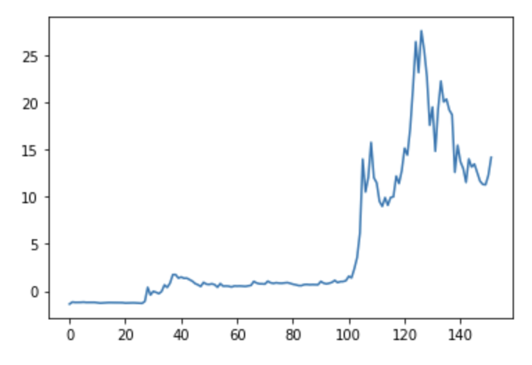
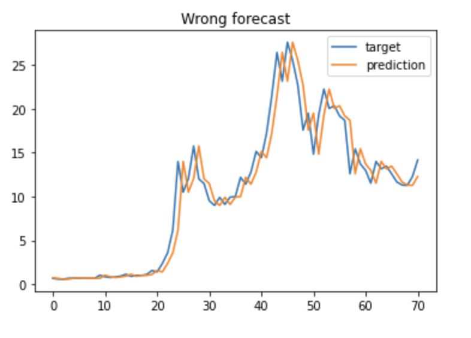
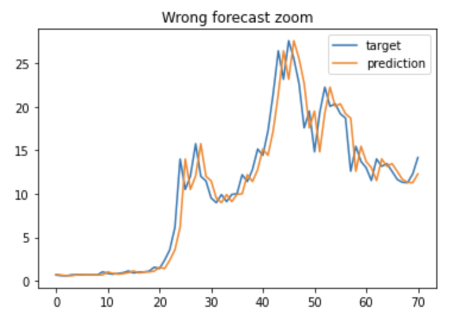
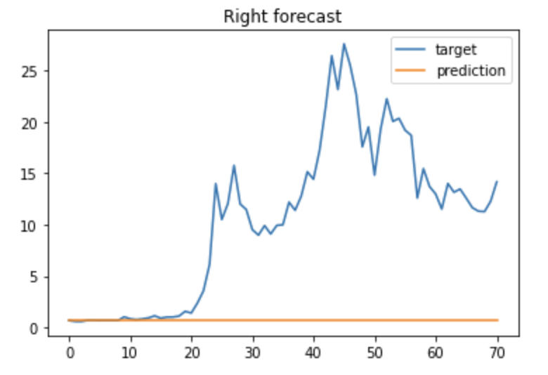

A few weeks ago I walked through some methods on predicting stock prices using Machine Learning and Python, now let’s try to do the same thing with a crypto currency, specifically Doge Coin.

## Importing / Installing the packages

Using numpy, pandas, matplotlib and SciKit-Learn as well as Yahoo’s finance packages, you can pip install these but since we’re using Google Colab these are already built in.

<table>
	<tr>
		<td align="center">
				
		</td>
    <td align="center">
				
		</td>
	</tr>
  <tr>
  <td align="center">
      
  </td>
  <td align="center">
      
  </td>
  </tr>

</table>

<h3>Support:</h3>

  
